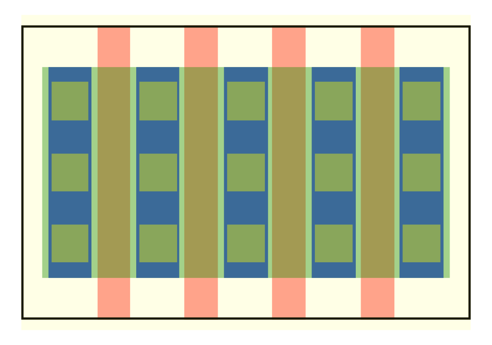

# openPCells -- A framework for tool-independent layout cell generators 
This project intends to develop a set of parametric cells (PCells) for use in analog integrated circuit design. Currently this is aimed at providing a
base set of cells for baseband and RF design (momcaps, inductors, transformers, transistors etc.), but ideally there would be also more complex cells
such as entire circuits (inverters, opamps etc.).

The key point of this framework is independency of any layout tool such as cadence virtuoso. In order to achieve this, the core generators are written
in lua and generate platform-independent files describing the cell. In the layout tool the files are read and the actual shapes are drawn. For this,
interfacing code is provided (currently only for virtuoso, but this is pretty simple to adapt). A second important point for this project is
technology independece. This is achieved by working in generic layers ('gate', 'metal1') and mapping that with (simple-to-write) layermaps.

# How to use
The project supplies some technology files for skywater130, so you can directly test the setup. In the main directory of the repository, run 

    ./opc -T skywater130 -I svg -C transistor

This produces the following image: 

. 

If you get an error, you should check your setup (just run `lua`, which will tell you the version. You need 5.2 or higher).

If the simple test is working you can put some paths in your shell configuration so you can access all modules from outside of this repository:
Set your `LUA_PATH` environment variable to the base path:

    # in your shell configuration file
    export LUA_PATH=";;/path/to/pcells/?.lua;/path/to/pcells/?/init.lua" # bash/zsh
    setenv LUA_PATH ";;/path/to/pcells/?.lua;/path/to/pcells/?/init.lua" # csh

Now you should be able to run `opc` from any directory (however, you have to specify the path to the executable or you can modify PATH).

<!---
# Installation for Cadence Virtuoso
The code has no dependencies except a working lua interpreter (>= 5.2), as we try to keep installation as easy as possible. Just clone this repository
and edit your `LUA_PATH` environment variable (described above) to include the path to the code (make sure to run this BEFORE you start virtuoso).
Then you need to set up your virtuoso interface. You need to include this file in your `.cdsinit`:

    ; in your .cdsinit
    load("/path/to/pcells/interface/virtuoso/init.il")

This will install a menu called `openPCells` at the last place before the `help` menu in the layout editor. This interface currently only includes
three cells: transistor, momcap and circular_inductor and is anyways pretty limited, as it does not allow any parametrization. This is easy to add,
but I need to find the time to do it. Most of the work is building GUIs for the parameters for every cell, which is boring, hence there is no work on
that. If you want to add this, look in the menu.il, there is some old code of mine that can be adapted to do something like that.
-->

# Technology translation and mapping
## Introduction
The pcells are defined in general layers (such as "gate" or "M1" or "lastmetal"), which have to be translated into a specific technology for
cell generation. This works in two runs: first vias have to be translated, as they are only defined as rectangular areas since we can't put any
spacing or sizing of the individual vias into the pcell. After this, all generic layers need to become technology-specific layers.
## How to add technologies
Every technology needs three files (currently, this might change in the future): a general configuration, a layer map and a via rules file.
Have a look in tech/template or tech/skywater130 on how to write these files.

The config is pretty simple:

    return {
    }

With this you're good to go as any data inside the table is not used any ways. But it should at least contain the grid, as I plan to include this in
the next time.

The layermap includes information on the human-readable layer data as well as the stream numbers (virtuoso could also work just with the stream
numbers, but often the layers have internal numbers that are NOT the stream numbers. Oh well). Therefore every entry is a table containing a table for
the layer and a table for the purpose:

    -- example
    lastmetal = { 
        layer = { name = "M8", number = 13 }, 
        purpose = { name = "drawing", number = 0 }
    }

The needed layers depends on the cells that are being used, but the program will also tell you when you are missing something. Therefore, you can also
keep running it until it works. The template layer map should contain most of the used layers, but I didn't consider all obscure technology features.

The via rules file is a bit more complex, as the via geometries and the needed layers need to be described (e.g. gate contacts in skywater130 need to
have a poly nitride cut). A typical entry looks like this (taken from tech/skywater130/viarules.lua):

    gatecont = {
        layers = {
            {
                lpp = {
                    layer   = { name = "poly",    number = 66 },
                    purpose = { name = "drawing", number = 20 },
                },
                enlarge = 0.1
            },
            {
                lpp = {
                    layer   = { name = "npc",     number = 95 },
                    purpose = { name = "drawing", number = 20 },
                },
                enlarge = 0.1
            },
            {
                lpp = {
                    layer   = { name = "licon1",  number = 66 },
                    purpose = { name = "drawing", number = 44 },
                },
            },
        },
        width = 0.17,
        height = 0.17, 
        xspace = 0.25, 
        yspace = 0.17, 
        xencl = 0.04, 
        yencl = 0.08
    }

The entry describes the geometry of the actual cuts and the needed layers. This works ok currently, but assumes that metal/poly strips with SEVERAL
cuts are drawn explicitly. I am working on this to improve that, but it works right now with this method.

# Roadmap
This project started as a way of designing pcells independently of SKILL/virtuoso and technologies, but I have shifted a bit my goals and am thinking
of building some kind of pcell-text-based layout description/generator. There is still a lot of work to do and right now the best use of this project
is as a pcell generator. Once I've really figured out how to do technology-independent pcells (which is already working a little bit), I will start
thinking of connecting several cells and creating entire layouts. 

# Contributions
Contributions of any kind are welcome and even wished for. I'm trying to add issues to github, but there's of course a lot more that needs to be
worked on. The most helpful currently would be people working in different technologies figuring out how the pcells need to be built and how the
technology translation has to work. I only have access to two technologies right now (three if you count skywater130, maybe four if you count
freepdk45), so any information on that would be greatly appreciated. Furthermore I'm happy about pcell contributions as well as general code
contributions. I'm also happy to know just what you are missing, if I find time I would be glad to implement that functionality.

<!---
vim: tw=150
-->
