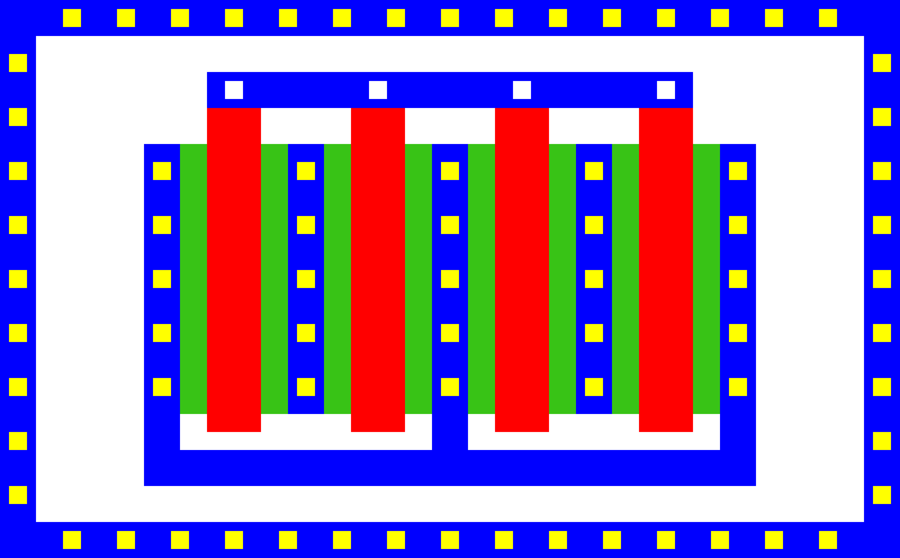
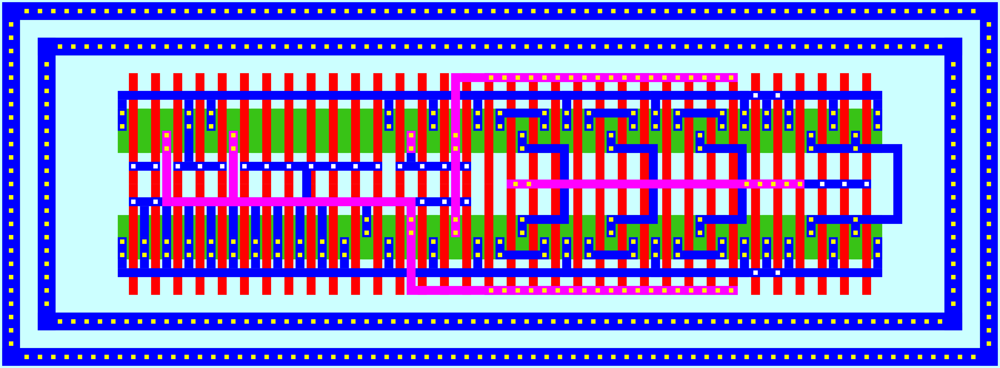

# opc (openPCells) &ndash; A framework for tool-independent layout cell generators
This project provides a layout generator for parametric cells (PCells) for use in analog/digital integrated circuit design.
It offers a framework for developing these pcells in a technology- and tool-independent way, so that cell re-use is greatly enhanced.
The cells are described in an intermediate format, which allows them to be converted to an actual technology node and file format.
Cell descriptions are implemented in [lua](https://www.lua.org) and can therefore incorporate any common programming constructs such as conditional statements and loops.
The project already provides a few implementations of basic cells widely used in integrated circuit design.
Among others there are elementary cells for mosfets and passive devices such as inductors and capacitors but also more complex cells such as
inverters, current mirrors, ring oscillators, guard rings, metal grids etc.
For digital designs, a set of standard cells exists (various types of d-flipflops and basic gates as nand, nor, and, or, etc.).
Furthermore, it is possible to generate entire chip layouts, leveraging parameterization and programming concepts, introducing a powerful tool for integrated circuit design.

In order to generate actual layouts for existing technology nodes, a *technology translation* has to be performed.
This translation is controlled by the technology layermap, which is fairly simple to write and can be built iteratively (it only has to include what
the actual generated cells require).
Within opc a few examplary technology files are already provided, for more information on writing technology mappings see the documentation about [technology files](./doc/techfiles.pdf).

Next to technology translation, the generated layouts are *exported* to a specific output format.
The export types that are currently provided are: GDSII, OASIS, SKILL (for use in cadence virtuoso), magic, TikZ (LaTeX, for easy drawing of layouts) and SVG.
Simple export types are easy to write and integrate.
OpenPCells supports both exports written in C or lua, whereas the latter can be loaded dynamically without compiling.
In both languages only a handfull of functions have to be implemented to start with a working and already capable export type.
See the [documentation](./doc/export.pdf) for more information on this topic.

The building of the tool is intended to be as simple as possible: it has no dependencies except for a C compiler.
For installation there is support for the classic `./configure.sh && make && sudo make install`, but the setup of the tool also allows for easy local installation.
For more instructions on building and installation, see the section about [building and installation](#building-and-installation).

# Basic Usage
After building opc, layouts can be generated either from pcell definition (`--cell` option) or from so-called cellscripts (`--cellscript`).
Besides a cell/cellscript, a technology node (`--technology`) and an export type (`--export`) must be provided.
The project supplies generic technology files ('opc'), so you can directly test the setup.
Common required export formats are also available.
Currently, the most important and sophisticated export type is the GDSII (`--export gds`), but for this introduction the SVG format will be used to directly show the generated layouts [^1].
Since IC layouts are not suitable to be viewed as a flat images, these representations only give an overview and are not meant to show the actual circuit layouts.
Positional command line arguments (that is, arguments without `-` or `--`) are taken as key-value pairs for cell parameters:

    ./opc --technology opc --export svg --cell basic/mosfet
    ./opc --technology opc --export svg --cell basic/mosfet fingers=4

These two calls produce the following images:

The mosfet cell currently supports around 100 parameters, it can draw gate contacts, guard rings, deep n-wells and many more.
The more complex example

    ./opc --technology opc --export svg --cell basic/mosfet gatelength=300 gatespace=500 fwidth=1500 fingers=4 drawtopgate=true connectsource=true drawguardring=true guardringxsep=200 guardringysep=200

produces

Increasing complexity is displayed by a current-starved ring oscillator:

    ./opc --technology opc --export svg --cell analog/current_starved_ringoscillator

Available cells can be listed with

    ./opc -L

Paths to additional cells can be given with

    ./opc --cellpath path/to/cells

OpenPCells provides an already quite rich set of command line options, which influence how layouts are generated.
Furthermore, it can also import GDSII-streams and create an opc-own representation of an entire library.
See `--read-gds` for this.
All command line options are documented with `--help` and a few basic examples for usage are given at the end.
Help for API functions is provided by `--api-list` (list all available API functions), `--api-search` (search for matching function names) and `api-help` (display detailed help about a specific function).

# Building and Installation
Building this project is fairly simple, as the sole dependency is a C compiler.
It was tested with various gcc versions >= 11.1.0 and 4.7.x, but should work with other compilers too.
The build and install process installs all required files in standard paths (/usr/bin, /usr/share), but these paths can be configured.
It is also possible to install it locally, which does not require any root privileges.
Short-cut configure options exist to make this process easy.
With this you can just leave everything where you built it and point your PATH to the directory or create an alias or call opc with its absolute path.

Building and installing system-wide:

    ./configure.sh
    make
    sudo make install

Building and installing locally:

    ./configure --all-load-paths-local
    make
    # no installation

This uses gcc as compiler, if you have any specific needs, the compiler can be adapted in `src/Makefile`.

Please note that if you don't 'install' opc (by copying it into the proper location), you should use `--all-load-paths-local`.
This configures the load paths so that opc can be called with the absolute path (or an alias). If you don't plan to install opc properly, you should
use the second shown build method ('Building and installing locally').

# Integration in EDA Tools
OpenPCells can be integrated quite simply in EDA tools that provide an API for adding menus, calling external programs and reading files.
In this project an interface to cadence virtuoso is included.
In order to load it need to include these lines in your `.cdsinit`:

    ; in your .cdsinit
    OPCTech = "TECH"            ; edit to match your PDK
    OPCPath = "/path/to/pcells" ; edit to match the path to opc
    OPCExec = "opc"             ; edit to match the name of the executable (usually 'opc')
    load(lsprintf("%s/%s" OPCPath "export/virtuoso/init.il")

This will install a menu in layout editor called `openPCells` at the last place before the `help` menu in the layout editor. You have to restart
virtuoso or execute the four lines in that order in your CIW to activate the menu. It is important that the variables `OPCTech`, `OPCPath` and
`OPCExec` are defined, so don't skip these and hard-code the path. There is an example file that you can modify and load in your
`.cdsinit` in `interface/virtuoso/cdsinit.il.sample`

---

[^1]: Technically, the here displayed images are png files, but these are conversion results from the generated SVG. A binary image format with compression like png is more complex than an SVG. Furthermore it is not vital (but desirable) to this project, therefore there is currently no implementation of it.

<!---
vim: tw=150
-->
