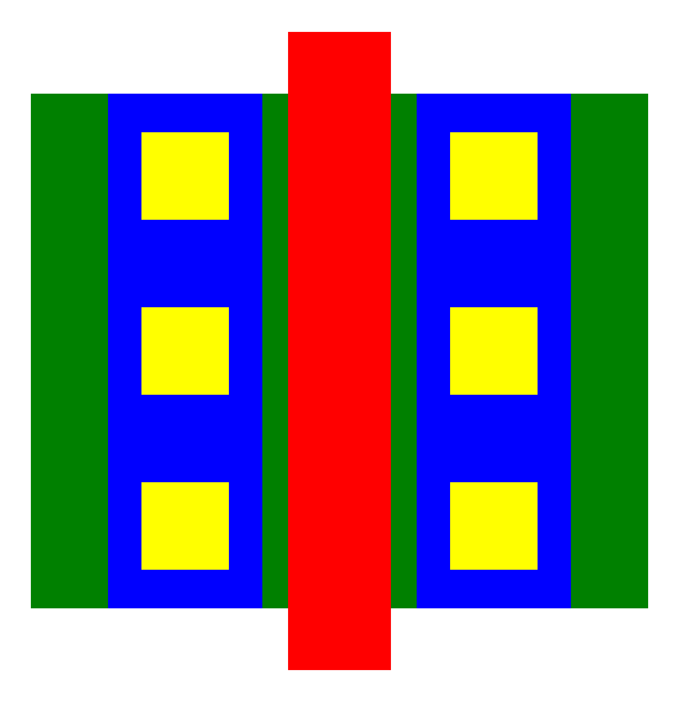
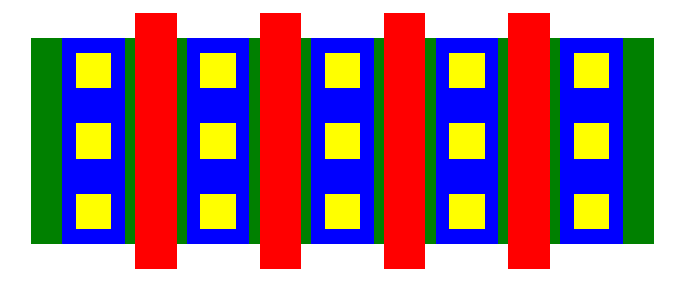

# openPCells -- A framework for tool-independent layout cell generators 
This project provides a layout generator for parametric cells (PCells) for use in analog/digital integrated circuit design. 
It offers a framework for developing these pcells in a technology-independent way, so that cell re-use is greatly enhanced. 
Currently, a base set of cells for baseband and RF design (momcaps, inductors, transformers, transistors etc.) as well as more complex cells such as
entire circuits (inverters, opamps etc.) are available (though there still is a lot of work to do). For digital designs, a set of simple standard
cells exists (nand, nor, not).

Another key point of this framework is independency of any layout tool such as cadence virtuoso. In order to achieve this, the core generators are written
in lua and generate platform-independent files describing the cell. In the layout tool the files are read and the actual shapes are drawn. For this,
interfacing/exporting code is provided (currently for virtuoso, magic, gds, tikz (LaTeX) and svg; other export types are easy to add). A second
important point for this project is technology independece. This is achieved by working in generic layers ('gate', 'metal1') and mapping that with
(simple-to-write) layermaps.

# How to use
After building opc (see Building and Installation), layouts can be generated either from pcell definition (--cell option) (there are already some in the cell
subdirectory) or from so-called cellscripts (--cellscript). For this, a technology layer map file to export layouts. The project supplies generic
technology files ('opc'), so you can directly test the setup.

    ./opc --technology opc --export svg --cell basic/transistor

This produces the following image: 

. 

Positional command line arguments (that is, arguments without - or --) are taken as key-value pairs for cell parameters:

    ./opc --technology opc --export svg --cell basic/transistor fingers = 4

. 

Available cells can be listed with

    ./opc -L

Paths to additional cells can be given with

    ./opc --cellpath path/to/cells

Different exports are supported, such as GDSII (which is the most sophisticated), SVG, SKILL (for virtuoso integration), TikZ (LaTeX), OASIS and magic.
A framework for developing additional exports is provided and only a few functions are needed to get a basic export running.

opc provides an already quite rich set of command line options, which influence how layouts are generated. Furthermore, it can also import
GDSII-streams and create an opc-own representation of an entire library. See --read-GDS for this. All command line options are documented with --help
and a few basic examples for usage are given at the end.

# Building and Installation
Building this project is fairly simple, as the sole dependency is a C compiler. It was tested with gcc 11.1.0, but should work with other compilers
too. Currently, the build is set up to create a stand-alone executable, which knows how to load the needed shared libraries (project-owned) by itself.
This means that it is easy for a user without any root privileges to install opc: Just leave it where you compiled it (this is important) and point
your PATH to the directory or create an alias or call opc with its absolute path. That all said, building is just

    make

# Integration in Cadence Virtuoso
After you compiled the program and checked if it works (see previous section), you can integrate it in virtuoso.
You need to include these lines in your `.cdsinit`:

    ; in your .cdsinit
    OPCTech = "TECH"            ; edit to match your PDK
    OPCPath = "/path/to/pcells" ; edit to match the path to opc
    OPCExec = "opc"             ; edit to match the name of the executable (usually 'opc')
    load(lsprintf("%s/%s" OPCPath "export/virtuoso/init.il")

This will install a menu in layout editor called `openPCells` at the last place before the `help` menu in the layout editor. You have to restart
virtuoso or execute the four lines in that order in your CIW to activate the menu. It is important that the variables `OPCTech`, `OPCPath` and
`OPCExec` are defined, so don't think you can skip these and hard-code the path. There is an example file that you can modify and load in your
`.cdsinit` in `interface/virtuoso/cdsinit.il.sample`

<!---
# Technology translation and mapping
## Introduction
The pcells are defined in general layers (such as "gate" or "M1" or "lastmetal"), which have to be translated into a specific technology for
cell generation. This works in two runs: first vias have to be translated, as they are only defined as rectangular areas since we can't put any
spacing or sizing of the individual vias into the pcell. After this, all generic layers need to become technology-specific layers.
## How to add technologies
Every technology needs three files (currently, this might change in the future): a general configuration, a layer map and a via rules file.
Have a look in tech/template or tech/opc on how to write these files.

The config is pretty simple:

    return {
    }

With this you're good to go as any data inside the table is not used any ways. But it should at least contain the grid, as I plan to include this in
the next time.

The layermap includes information on the human-readable layer data as well as the stream numbers (virtuoso could also work just with the stream
numbers, but often the layers have internal numbers that are NOT the stream numbers. Oh well). Therefore every entry is a table containing a table for
the layer and a table for the purpose:

    -- example
    lastmetal = { 
        layer = { name = "M8", number = 13 }, 
        purpose = { name = "drawing", number = 0 }
    }

The needed layers depends on the cells that are being used, but the program will also tell you when you are missing something. Therefore, you can also
keep running it until it works. The template layer map should contain most of the used layers, but I didn't consider all obscure technology features.

The via rules file is a bit more complex, as the via geometries and the needed layers need to be described (e.g. gate contacts in skywater130 need to
have a poly nitride cut). A typical entry looks like this (taken from tech/skywater130/viarules.lua):

    gatecont = {
        layers = {
            {
                lpp = {
                    layer   = { name = "poly",    number = 66 },
                    purpose = { name = "drawing", number = 20 },
                },
                enlarge = 0.1
            },
            {
                lpp = {
                    layer   = { name = "npc",     number = 95 },
                    purpose = { name = "drawing", number = 20 },
                },
                enlarge = 0.1
            },
            {
                lpp = {
                    layer   = { name = "licon1",  number = 66 },
                    purpose = { name = "drawing", number = 44 },
                },
            },
        },
        width = 0.17,
        height = 0.17, 
        xspace = 0.25, 
        yspace = 0.17, 
        xencl = 0.04, 
        yencl = 0.08
    }

The entry describes the geometry of the actual cuts and the needed layers. This works ok currently, but assumes that metal/poly strips with SEVERAL
cuts are drawn explicitly. I am working on this to improve that, but it works right now with this method.
-->

# Roadmap
This project started as a way of designing pcells independently of SKILL/virtuoso and technologies, but I have shifted a bit my goals and am thinking
of building some kind of pcell-text-based layout description/generator. The ground work has been done and it is already possible to build very complex
layouts with good performance of the tool. By re-using cells, the generation time can be kept quite low.

The next steps deal with building more complex and sophisticated pcells, adding more functionality to pcell development easier (such as the placement
module, perhaps also adding automatic routing) and fixing existing bugs. Furthermore, technology file development could be more automated, I was
thinking of an assistant to do this, but I'm lacking the time.

# Contributions
Contributions of any kind are welcome and even wished for. I'm trying to add issues to github, but there's of course a lot more that needs to be
worked on. The most helpful currently would be people working in different technologies figuring out how the pcells need to be built and how the
technology translation has to work. I only have access to two technologies right now (three if you count skywater130, maybe four if you count
freepdk45), so any information on that would be greatly appreciated. Furthermore I'm happy about pcell contributions as well as general code
contributions. I'm also happy to know just what you are missing, if I find time I would be glad to implement that functionality.

<!---
vim: tw=150
-->
